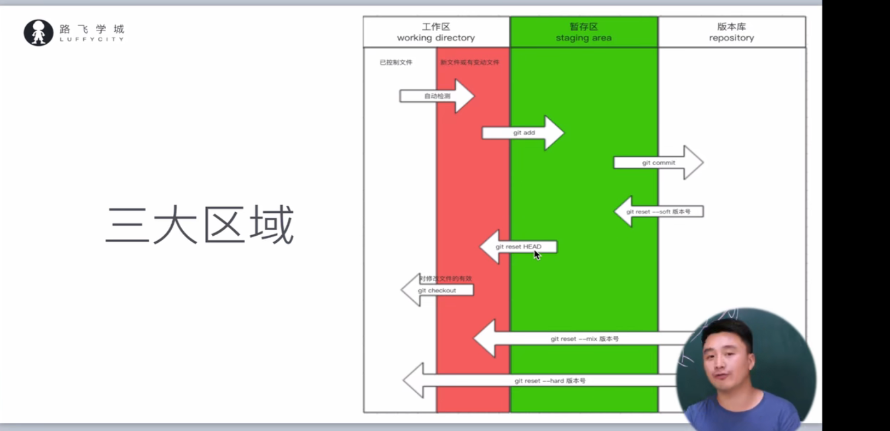
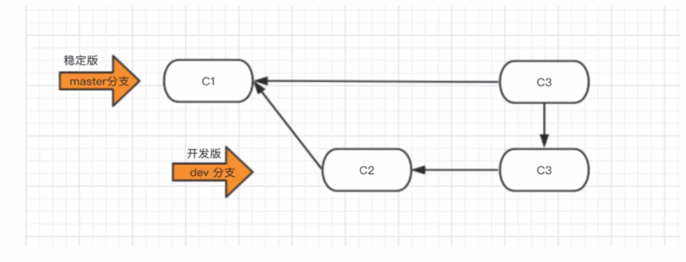

# Git分布式版本控制工具

## 1、目标

- 了解Git基本概念
- 能够概述Git工作流程
- 能够使用Git常用命令
- 熟悉Git代码托管服务
- 能够使用idea操作Git

## 2、概述

### 2.1、开发中的实际场景

> 场景一：备份
>
> ​          防止文件丢失
>
> 场景二：代码还原
>
> ​        将经过多次开发的代码还原到之前的版本。
>
> 场景三：协同开发
>
> ​        多人维护一个项目。
>
> 场景四：追溯问题代码的编写人和编写时间
>
> ​         查找问题代码的，编写人和编写时间。

# 第二章 git操作

## 第一阶段：单枪匹马开始干

初始使用git对一个目录进行版本控制需要以下步骤：

- 进入要管理的文件夹

- 执行初始化命令

  ```dockerfile
  git init
  ```

- 查看目录下的文件状态

  ```dart
  git status
  注：新增文件或被修改的文件颜色是红色
  ```

- 管理指定文件（红变绿）

  ```
  git add 文件名
  git add .
  ```

- 个人信息配置：用户名，邮箱【一次即可】

- 生成版本

  ```
  git commit -m'版本描述'
  ```

- 产看版本记录

  ```
  git log
  ```

## 第二阶段：拓展新功能

```
git add
git commit -m'版本简介'
```

## 第三阶段：“约饭事件”

+ 回滚至之前版本

  ```
  git log
  git reset --hard 版本号
  ```

+ 回滚至之后的版本（后悔回滚了，想要回滚回来）

  ```
  git reflog
  git reset --hard 版本号
  ```

## 2.4 总结

```
git init
git add
git commit -m'版本信息'
git log
git reflog
git reset -hard 版本号
```

工作区、暂存区（缓冲的作用）、版本库

## 2.5 分支

分支是对主干内容的一份拷贝。当项目需要开发一个新的功能或新的任务时，单独建立一个分支去开发，开发完毕后合并到主干分支上则完成了任务。

- 分支合并实际对应的逻辑是对分支的操作行为进行合并，比如a的分支b进行了的十项操作，最后要让b分支修改的内容同步到a分支上，则是分支合并，最后对应的就是系软件在b上的操作，在a上再执行一遍。

### 2.5.1 命令总结

- 查看分支

  ```
  git branch
  ```

- 创建分支

  ```
  git checkout 分支名称git branch 分支名
  ```

- 切换分支

  head 意思就是当前工作区所指向的分支。checkout意思就是将哪个分支的文件拉倒工作区。

  ```
  git checkout 分支名称
  ```

- 分支合并（可能产生冲突）

  ```
  git merge 要合并的分支名称
  注意： git merge 分支A   将分支A的变化合并到当前分支
  ```

- 删除分支

  ```
  git branch -d 分支名称
  ```

### 2.5.3 工作流



## 2.6 第五阶段：进军三里屯

```
1、给远程残酷起别名
   git remote add 远程仓库别名 仓库地址
   git remote add origin https://github.com/JianmingXu-990/firstTest.git
2、向远程推送代码
   git push -u origin 分支名称
```

```
1、克隆远程仓库代码
   git clone 远程仓库地址（内部已实现git remote add origin https://github.com/JianmingXu-990/firstTest.git）
2、切换分支
   git checkout 分支
```

